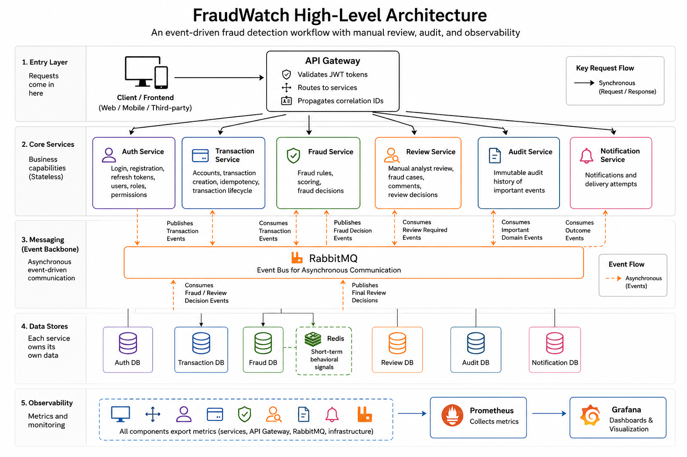
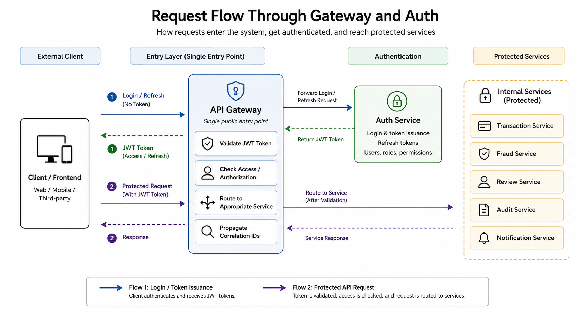
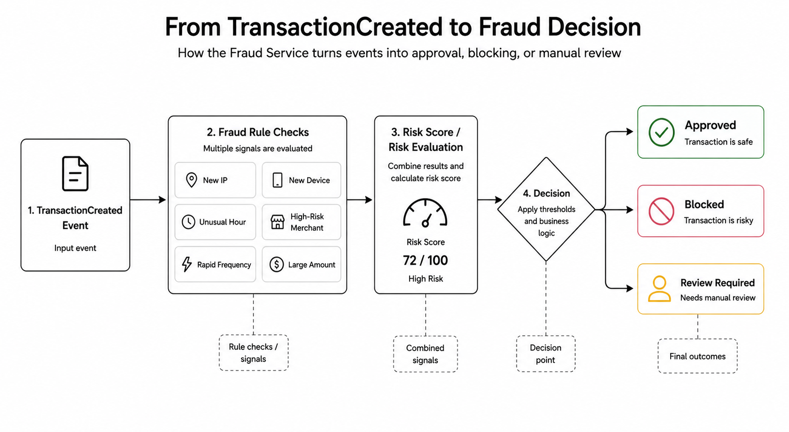
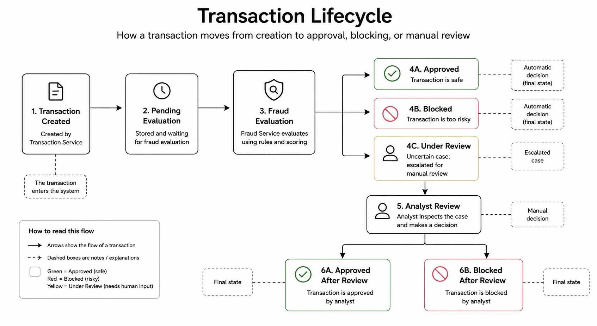
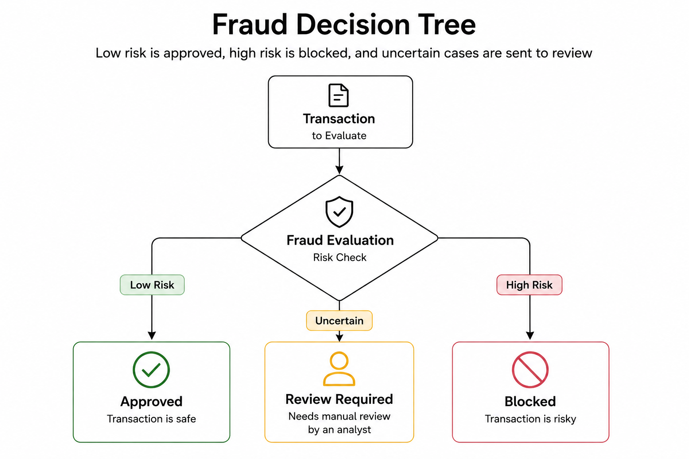

# FraudWatch

FraudWatch is a Java 17 / Spring Boot microservice platform for real-time banking fraud detection. It is built as an event-driven monorepo with isolated bounded contexts, per-service PostgreSQL databases, RabbitMQ messaging, Redis-backed behavioral checks, and an observability stack based on Actuator, Prometheus, and Grafana.

## Overview

This project models a realistic fraud decision pipeline:

- customers authenticate and submit transactions through `api-gateway`
- `transaction-service` stores the request and publishes domain events
- `fraud-service` scores the transaction using configurable rules and Redis-backed behavior signals
- medium-risk cases go to `review-service` for analyst review
- final outcomes are propagated back to `transaction-service`
- `audit-service` stores an immutable operational trail
- `notification-service` records and mock-delivers outcome notifications

The repository is intended to be runnable locally as a full system, not just as isolated services.

## Key Features

- Spring Boot microservice monorepo with shared libraries
- Gateway-enforced JWT authentication and permission-based RBAC
- Idempotent transaction creation and transaction lifecycle management
- Configurable fraud rules with direct approve, review, and block paths
- Manual review workflow with assignment, comments, and analyst decisions
- Immutable audit history built from domain events
- Notification persistence with delivery attempt tracking
- Docker Compose environment with PostgreSQL, RabbitMQ, Redis, Prometheus, and Grafana
- CI checks for Maven validation, service tests, Docker image builds, Compose config, and demo/observability assets

## Architecture At A Glance



For more detail, see [Architecture Overview](docs/architecture/overview.md) and [System Diagram](docs/architecture/system-diagram.md).

## Services

| Service | Port | Responsibility |
| --- | --- | --- |
| `api-gateway` | `8080` | External entry point, JWT validation, routing, correlation id propagation |
| `auth-service` | `8081` | Registration, login, refresh tokens, users, roles, permissions |
| `transaction-service` | `8082` | Accounts, transactions, idempotency, transaction status lifecycle |
| `fraud-service` | `8083` | Fraud rule evaluation, scoring, decision publishing, Redis-backed checks |
| `review-service` | `8084` | Manual review cases, analyst actions, comments, final review decisions |
| `audit-service` | `8085` | Immutable audit records and read-only audit API |
| `notification-service` | `8086` | Notification storage, templates, delivery attempts, mock delivery |

## Repository Layout

```text
fraudwatch/
  services/
    api-gateway/
    auth-service/
    transaction-service/
    fraud-service/
    review-service/
    audit-service/
    notification-service/
  libs/
    common-events/
    common-observability/
    common-security/
    common-test/
  infrastructure/
    grafana/
    prometheus/
  docs/
    api/
    architecture/
    diagrams/
    erd/
    events/
    runbooks/
  scripts/
    demo/
    dev/
  compose.yml
  pom.xml
```

## Main Flow

1. The client authenticates through `auth-service` via `api-gateway`.
2. A transaction is created in `transaction-service`.
3. `transaction-service` publishes `TransactionCreated`.
4. `fraud-service` consumes the event and emits one of:
   - `TransactionApproved`
   - `TransactionBlocked`
   - `TransactionReviewRequired`
5. `transaction-service` updates the transaction lifecycle based on the fraud decision.
6. If review is required, `review-service` creates a fraud case.
7. An analyst approves or blocks the case in `review-service`.
8. `review-service` publishes `ReviewDecisionMade`.
9. `audit-service` and `notification-service` consume key outcome events.

More detail is available in [Event Flow](docs/events/event-flow.md) and [Transaction Review Sequence](docs/diagrams/transaction-review-sequence.md).

## Visual Flows

### Request Flow Through Gateway And Auth



### Transaction To Fraud Decision



### Transaction Lifecycle



### Fraud Decision Logic



## Documentation

All links below are repository-relative and valid on GitHub:

- [Architecture Overview](docs/architecture/overview.md)
- [System Diagram](docs/architecture/system-diagram.md)
- [Transaction Review Sequence](docs/diagrams/transaction-review-sequence.md)
- [Service Data Models](docs/erd/service-data-models.md)
- [Service APIs](docs/api/service-apis.md)
- [Event Flow](docs/events/event-flow.md)
- [Trade-Offs And Scaling Path](docs/architecture/trade-offs-and-scaling.md)
- [Local Runbook](docs/runbooks/local-run.md)

## Local Development

### Prerequisites

- Java 17
- Docker Desktop with Compose
- PowerShell
- Optional: Maven installed globally, though the repository includes `mvnw`

### Validate The Monorepo

```powershell
.\mvnw.cmd -q validate
```

### Start The Full Stack

```powershell
docker compose up --build
```

### Run A Smoke Check

```powershell
powershell -ExecutionPolicy Bypass -File .\scripts\dev\smoke-check.ps1
```

The smoke check waits for service health endpoints, validates internal info endpoints, and confirms that Prometheus, Grafana, and RabbitMQ are reachable.

### Rebuild From A Clean Local State

```powershell
powershell -ExecutionPolicy Bypass -File .\scripts\dev\clean-start.ps1
```

This removes Compose volumes, so it should be treated as a local reset.

### Stop The Stack

```powershell
docker compose down
```

## Demo Scenarios

After the stack becomes healthy, run:

```powershell
powershell -ExecutionPolicy Bypass -File .\scripts\demo\full-flow.ps1
```

By default, the script runs the `review-block` scenario. The supported variants are:

```powershell
powershell -ExecutionPolicy Bypass -File .\scripts\demo\full-flow.ps1 -Scenario approved
powershell -ExecutionPolicy Bypass -File .\scripts\demo\full-flow.ps1 -Scenario review-approve
powershell -ExecutionPolicy Bypass -File .\scripts\demo\full-flow.ps1 -Scenario review-block
powershell -ExecutionPolicy Bypass -File .\scripts\demo\full-flow.ps1 -Scenario direct-block
```

The script:

- waits for `api-gateway` health
- registers a fresh demo user
- creates a funded account
- runs the selected fraud scenario
- waits for the final transaction state
- fetches related audit records and notifications

Local demo credentials seeded by `auth-service`:

- `analyst.demo` / `AnalystPass123!`
- `admin.demo` / `AdminPass123!`

## Useful Endpoints

- Gateway Swagger: `http://localhost:8080/swagger-ui.html`
- Auth Swagger: `http://localhost:8081/swagger-ui.html`
- Transaction Swagger: `http://localhost:8082/swagger-ui.html`
- Fraud Swagger: `http://localhost:8083/swagger-ui.html`
- Review Swagger: `http://localhost:8084/swagger-ui.html`
- Audit API: `http://localhost:8085/api/audit/records`
- Notification API: `http://localhost:8086/api/notifications`
- RabbitMQ UI: `http://localhost:15672`
- Prometheus: `http://localhost:9090`
- Grafana: `http://localhost:3000`

## Observability And Operations

- All services expose health and metrics endpoints through Spring Boot Actuator.
- Prometheus scraping is wired through `/actuator/prometheus`.
- Docker Compose waits for infrastructure and application health before promoting downstream dependencies.
- Grafana provisioning includes a preloaded `FraudWatch Overview` dashboard in `infrastructure/grafana/dashboards`.
- Runtime Docker images include `wget` so container health checks can probe `/actuator/health`.

## Project Status

The project is in a completed MVP state:

- core fraud, review, audit, and notification flows are implemented
- gateway-enforced RBAC is active for customer, analyst, and admin-facing APIs
- local end-to-end demo scenarios are scripted
- CI validates code, configuration, demo assets, and service-level tests
