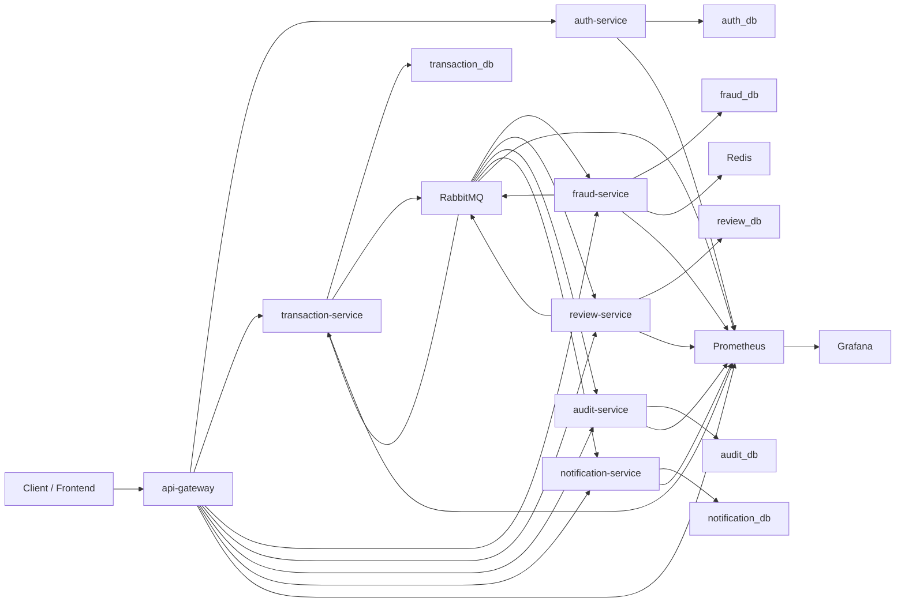

# System Diagram

## Notes

- `api-gateway` is the single external HTTP entry point.
- Each service owns its own PostgreSQL database.
- RabbitMQ carries domain events between services.
- Redis stores short-window fraud behavior signals.
- Prometheus scrapes service and infrastructure metrics; Grafana visualizes them.
