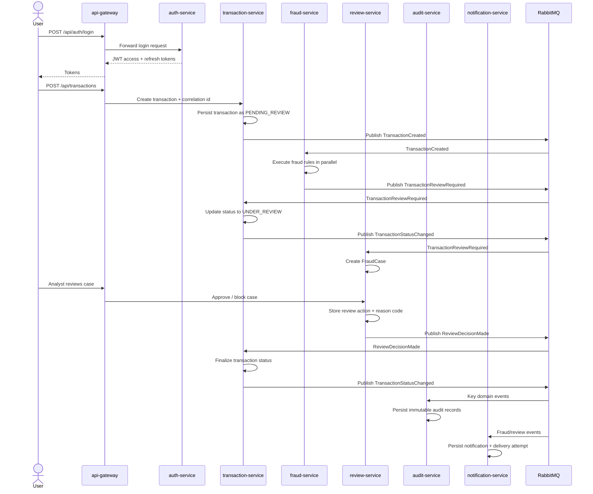

# Transaction Review Sequence

## Covered Variants

- Low-risk transactions end at `APPROVED` without manual review.
- High-risk transactions can be `BLOCKED` directly by `fraud-service`.
- Medium-risk transactions follow the analyst review branch shown above.
