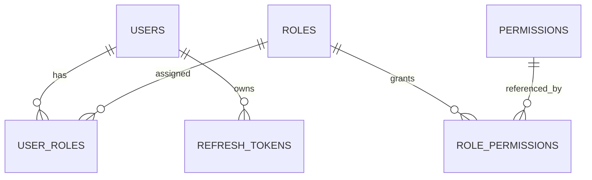
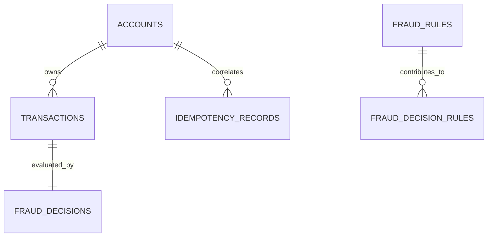
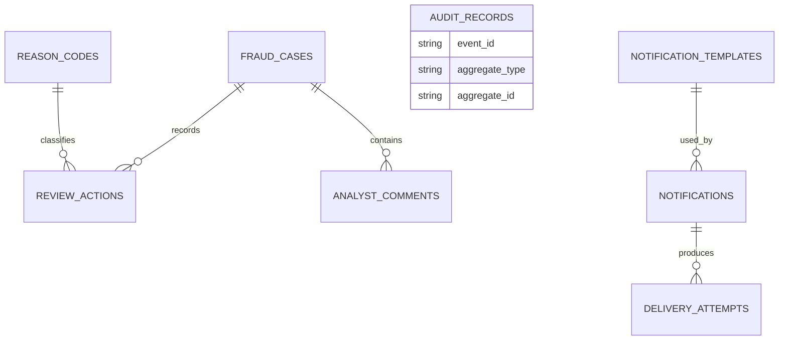

# Service Data Models

## Auth Service

## Transaction And Fraud Domains

Notes:

- `transaction-service` persists account and transaction lifecycle state.
- `fraud-service` keeps rule configuration and final fraud decisions separately.

## Review, Audit, And Notification Domains

Notes:

- `audit-service` stores append-only event history.
- `notification-service` tracks rendered notifications and delivery attempts.
